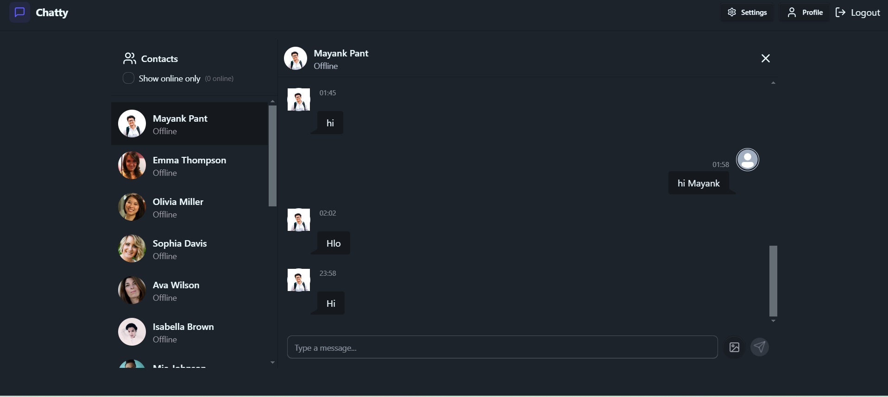

# Project Title

Chatty - Real-Time Messaging Application.

# Project Description 

Chatty is a real-time messaging application built using the MERN stack (MongoDB, Express.js, React.js, Node.js) combined with Socket.io for real-time communication. The application is styled using Tailwind CSS and Daisy UI, providing a modern and responsive user interface.

# Key Features 

1. Authentication & Authorization: Secure user authentication and authorization are implemented using JSON Web Tokens (JWT), ensuring that only authenticated users can access the application.

2. Real-Time Messaging: Leveraging Socket.io, the application supports real-time messaging, allowing users to send and receive messages instantly.

3. Online User Status: The application displays the online status of users, providing a seamless and interactive user experience.

4. Global State Management: Zustand is used for managing the global state of the application, ensuring efficient state management and data flow.

5. Error Handling: Comprehensive error handling is implemented both on the server and client sides, ensuring robust and reliable application performance.

# Installation 

Setup .env file
MONGODB_URI=...
PORT=5001
JWT_SECRET=...

CLOUDINARY_CLOUD_NAME=...
CLOUDINARY_API_KEY=...
CLOUDINARY_API_SECRET=...

NODE_ENV=development
Build the app
npm run build
Start the app
npm start

# Project Screenshot 

